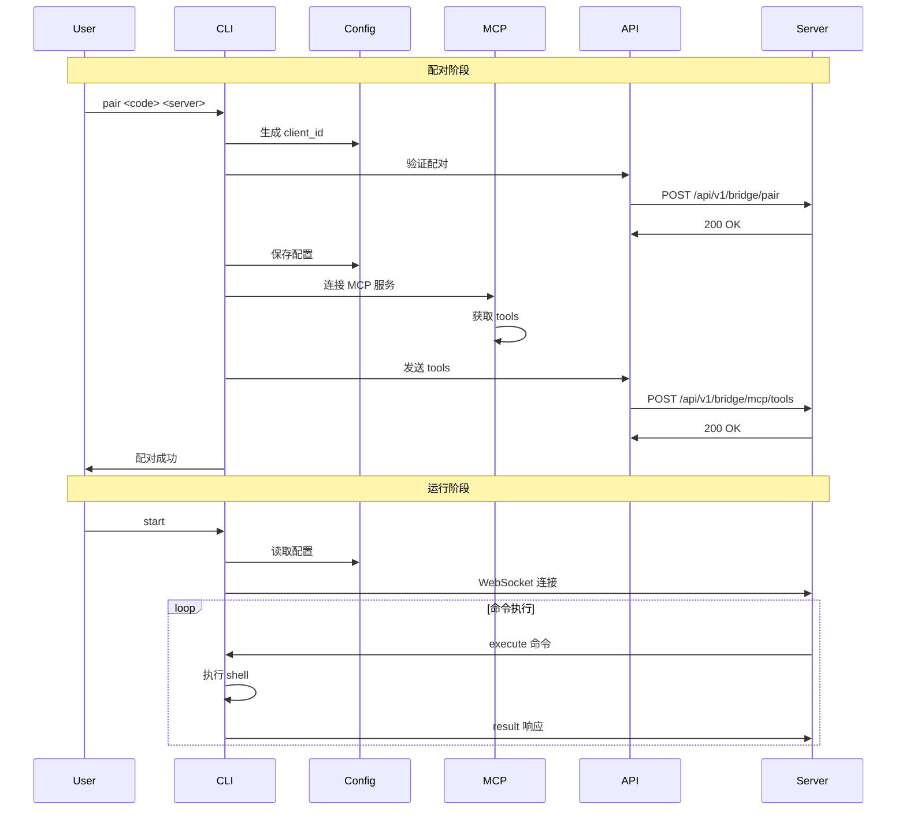

# Castrel Bridge Proxy

一个轻量级的远程命令执行桥接客户端，通过 WebSocket 连接到服务端，接收并执行命令。

## 功能特性

- ✅ **安全配对**: 使用验证码与服务端配对
- ✅ **持久配置**: 配置保存在 `~/.castrel/config.yaml`
- ✅ **唯一标识**: 基于机器特征生成稳定的客户端 ID
- ✅ **WebSocket 连接**: 实时双向通信
- ✅ **命令执行**: 执行 shell 命令并返回结果
- ✅ **自动重连**: 连接断开时自动重连
- ✅ **超时控制**: 命令执行超时保护
- ✅ **MCP 集成**: 连接本地 MCP 服务并同步 tools 信息

## 安装

使用 `uv` 安装依赖：

```bash
uv sync
```

## 使用方法

### 1. 配对到服务端

首先需要使用验证码与服务端配对：

```bash
castrel-bridge-cli pair <验证码> <服务端URL>
```

**示例：**
```bash
castrel-bridge-cli pair ABC123 https://server.example.com
```

配对成功后，配置会保存到 `~/.castrel/config.yaml`。

### 2. 查看配置

查看当前保存的配置信息：

```bash
castrel-bridge-cli config
```

**输出示例：**
```
=== 配置信息 ===
配置文件: /Users/username/.castrel/config.yaml
服务端URL: https://server.example.com
验证码: ABC123
客户端ID: a1b2c3d4e5f6
配对时间: 2025-12-22T10:30:00Z
```

### 3. 启动 Bridge 服务

启动 bridge 连接到服务端：

```bash
# 前台运行
castrel-bridge-cli start

# 按 Ctrl+C 停止服务
```

启动后，客户端会：
1. 连接到服务端的 WebSocket 接口
2. 等待服务端发送命令
3. 执行命令并返回结果
4. 如果连接断开，自动重连

### 4. 查看状态

查看 bridge 的运行状态：

```bash
castrel-bridge-cli status
```

### 5. 配置 MCP 服务（可选）

如果需要使用 MCP（Model Context Protocol）功能，创建 `~/.castrel/mcp.json` 配置文件：

```bash
# 复制示例配置
cp mcp.json.example ~/.castrel/mcp.json

# 编辑配置文件
nano ~/.castrel/mcp.json
```

**配置示例：**
```json
{
  "mcpServers": {
    "filesystem": {
      "command": "npx",
      "args": ["-y", "@modelcontextprotocol/server-filesystem", "/path/to/dir"],
      "env": {}
    },
    "github": {
      "command": "npx",
      "args": ["-y", "@modelcontextprotocol/server-github"],
      "env": {
        "GITHUB_PERSONAL_ACCESS_TOKEN": "your-token"
      }
    }
  }
}
```

### 6. 管理 MCP 服务

**列出配置的 MCP 服务：**
```bash
castrel-bridge-cli mcp-list
```

**手动同步 MCP tools 到服务端：**
```bash
castrel-bridge-cli mcp-sync
```

注意：配对成功时会自动同步 MCP tools，也可以随时手动同步。

### 7. 取消配对

取消与服务端的配对，删除配置文件：

```bash
castrel-bridge-cli unpair
```

## 配置文件

### Bridge 配置 (`~/.castrel/config.yaml`)

配对信息保存在此文件：

```yaml
server_url: "https://server.example.com"
verification_code: "ABC123"
client_id: "a1b2c3d4e5f6"
paired_at: "2025-12-22T10:30:00Z"
```

### MCP 配置 (`~/.castrel/mcp.json`)

MCP 服务配置（可选），支持 `stdio` 和 `http` 两种传输方式：

**Stdio 方式（本地子进程）：**
```json
{
  "mcpServers": {
    "server-name": {
      "transport": "stdio",
      "command": "command-to-run",
      "args": ["arg1", "arg2"],
      "env": {
        "ENV_VAR": "value"
      }
    }
  }
}
```

**HTTP 方式（远程服务器）：**
```json
{
  "mcpServers": {
    "server-name": {
      "transport": "http",
      "url": "http://localhost:8000/mcp"
    }
  }
}
```

参考 `mcp.json.example` 文件查看完整示例。

## 相关文档

- [COMMANDS.md](COMMANDS.md) - 完整命令参考手册
- [API_ENDPOINTS.md](API_ENDPOINTS.md) - API 端点说明文档
- [PROTOCOL.md](PROTOCOL.md) - WebSocket 消息协议详解
- [MCP.md](MCP.md) - MCP 集成完整指南

## 命令协议

详细的 WebSocket 消息协议请参考 [PROTOCOL.md](PROTOCOL.md)。

### 快速示例

**服务端发送命令：**
```json
{
  "id": "msg-001",
  "type": "execute",
  "command": "ls -la"
}
```

**客户端返回结果：**
```json
{
  "id": "msg-001",
  "type": "result",
  "success": true,
  "data": {
    "exit_code": 0,
    "stdout": "文件列表...",
    "stderr": "",
    "execution_time": 0.123
  }
}
```

## 架构说明

### 系统架构

```
┌─────────────────────────────────────────────────┐
│           Bridge Client (本地)                  │
│                                                 │
│  ┌──────────────────────────────────────────┐  │
│  │         CLI (main.py)                    │  │
│  └──────────────────────────────────────────┘  │
│                    │                            │
│      ┌─────────────┼─────────────┐              │
│      │             │             │              │
│  ┌───▼────┐  ┌────▼─────┐  ┌───▼─────┐        │
│  │ Config │  │    MCP   │  │ WebSocket│        │
│  │Manager │  │  Manager │  │  Client  │        │
│  └────────┘  └──────────┘  └──────────┘        │
│                    │             │              │
│              ┌─────▼─────┐       │              │
│              │   MCP     │       │              │
│              │  Servers  │       │              │
│              │(filesystem│  ┌────▼─────┐       │
│              │  github   │  │ Command  │       │
│              │  postgres)│  │ Executor │       │
│              └───────────┘  └──────────┘       │
└─────────────────────────────────────────────────┘
                              │
                              │ WebSocket
                              ▼
┌─────────────────────────────────────────────────┐
│            Bridge Server (远程)                 │
│  /api/v1/bridge/ws?client_id=xxx&code=yyy       │
│  /api/v1/bridge/pair                            │
│  /api/v1/bridge/mcp/tools                       │
└─────────────────────────────────────────────────┘
```

### 工作流程



## 依赖项

- Python >= 3.13
- typer[all] >= 0.20.1
- pyyaml >= 6.0.1
- aiohttp >= 3.9.0
- mcp >= 1.0.0

## 安全注意事项

⚠️ **重要安全提示**

1. **验证码保护**: 验证码应该由服务端生成并安全传递给客户端
2. **命令执行权限**: 客户端以当前用户权限执行命令，请确保服务端可信
3. **网络安全**: 建议使用 HTTPS/WSS 加密连接
4. **命令审计**: 所有执行的命令都会记录到日志中

## 开发

### 项目结构

```
castrel-bridge-proxy/
├── bridge/
│   ├── __init__.py
│   ├── main.py              # CLI 主程序
│   ├── config.py            # 配置管理
│   ├── client_id.py         # 客户端 ID 生成
│   ├── api.py               # HTTP API 客户端
│   ├── websocket_client.py  # WebSocket 客户端
│   ├── executor.py          # 命令执行器
│   └── mcp_manager.py       # MCP 管理器
├── castrel_bridge_cli.py    # 入口文件
├── pyproject.toml           # 项目配置
├── mcp.json.example         # MCP 配置示例
├── README.md                # 本文件
└── PROTOCOL.md              # 协议文档
```

### 运行测试

```bash
# TODO: 添加测试
```

## License

MIT

